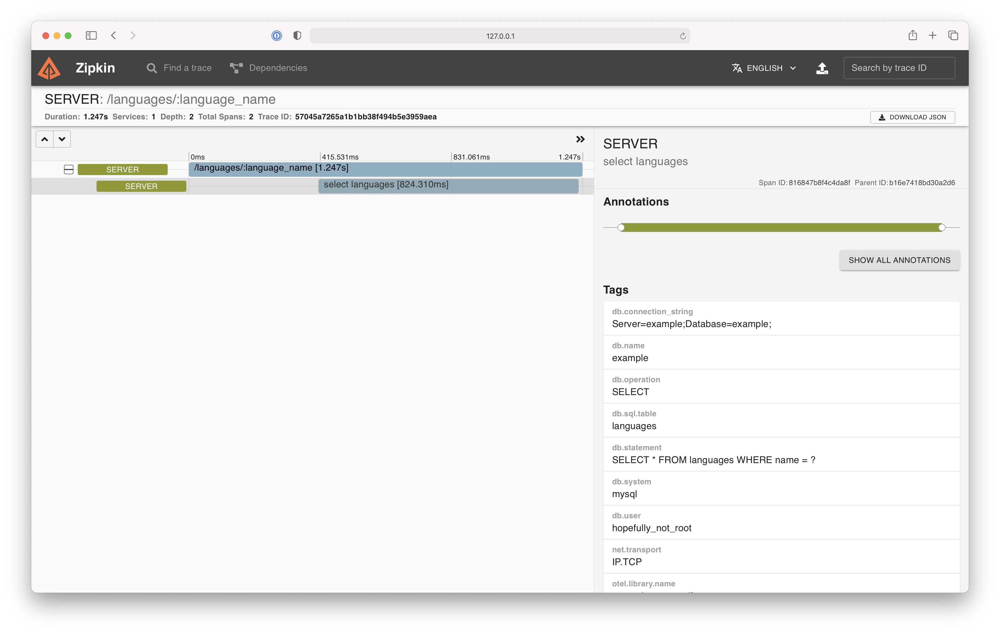
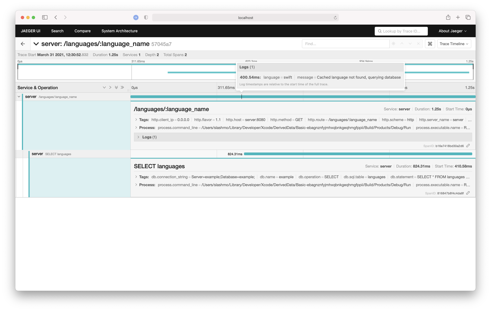

# OpenTelemetry for Swift
## Basic Example

This is minimal example of how to configure and start `OTel` by using the given defaults.
It leverages [`ServiceLifecycle`](https://github.com/swift-server/swift-service-lifecycle) to invoke `start` and `shutdown`.
Spans are being exported to both Jaeger & Zipkin by utilizing
the [OTel collector](https://github.com/open-telemetry/opentelemetry-collector) via a `OtlpGRPCSpanExporter`.

## Running 🏃‍♀️

### Start OTel Collector, Zipkin, and Jaeger 🐳

First, start the three docker containers via `docker-compose`:

```bash
docker-compose up
```

### Start the example 🐦

After waiting a few seconds for the three services to boot, you can now start the example:

```
LOG_LEVEL=trace swift run Run
```

## Inspecting 🧐

After successfully running the example app, one trace containing two spans will have been exported to both Zipkin & Jaeger through the OTel collector.

### Zipkin

Please follow these steps to view the trace in Zipkin:

1. Open [http://localhost:9411](http://localhost:9411)
2. Click on "+"
3. Enter `serviceName=server`
4. Click on "Run Query"
5. On the right side of the resulting trace, click "Show"
6. Enjoy the trace in all it's glory including both spans



To learn more about Zipkin, visit [https://zipkin.io](https://zipkin.io).

### Jaeger

Please follow these steps to view the trace in Jaeger:

1. Open [http://localhost:16686](http://localhost:16686)
2. Under Service, select `server`
3. Click on "Find Traces"
4. Select the trace
5. Enjoy tge trace in all it's glory including both spans
6. (Bonus) Hover over the vertical black line in the root span to view the event



To learn more about Jaeger, visit [https://www.jaegertracing.io](https://www.jaegertracing.io)

### Logs

Back in your Terminal, you might already have noticed that the exported spans have also been logged. This functionallity is provided by the OTel collector and can be configured in [`collector-config.yaml`](collector-config.yaml).
