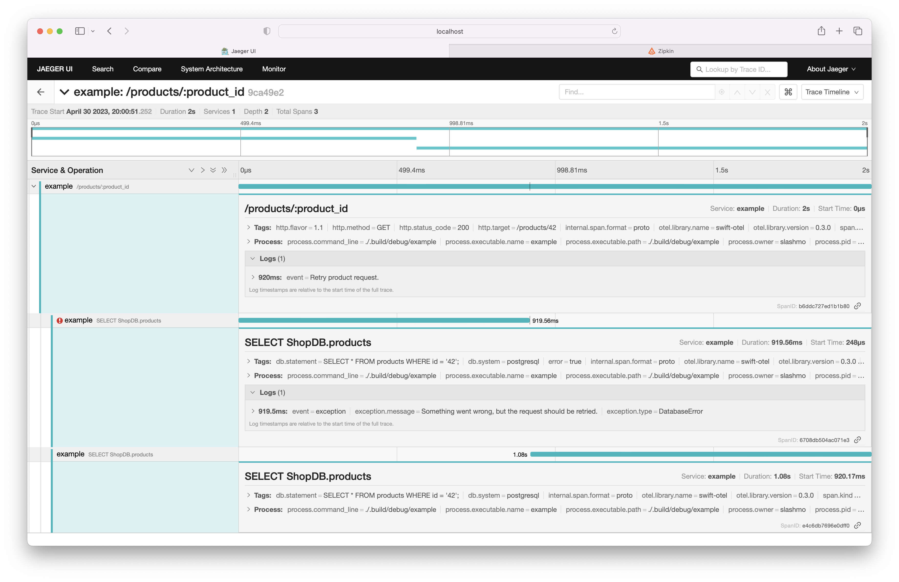
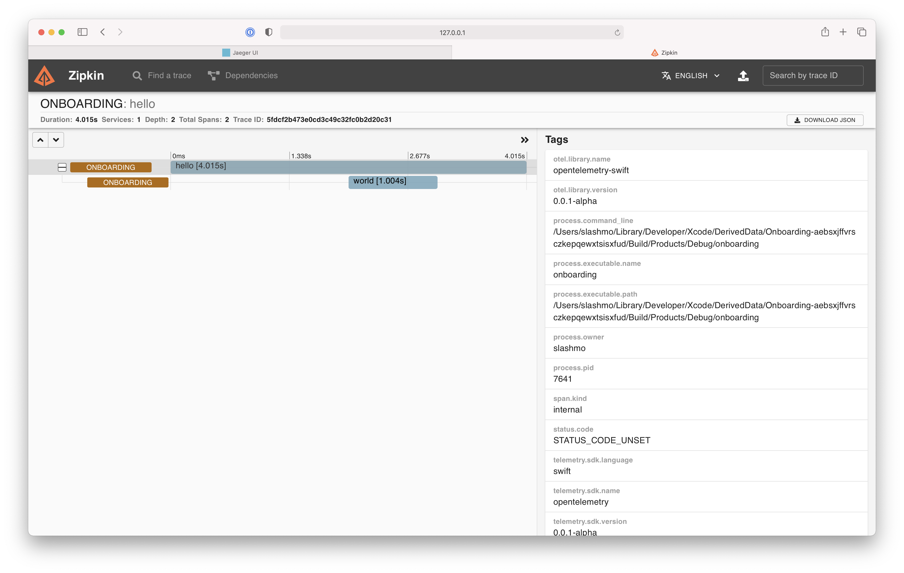

# OpenTelemetry for Swift

[](https://swift.org)
[](https://swift.org)
[](https://swift.org)
[](https://github.com/slashmo/opentelemetry-swift/actions/workflows/ci.yaml)

[](https://github.com/apple/swift-distributed-tracing)

An OpenTelemetry client implementation for Swift.

"OpenTelemetry Swift" builds on top of [Swift Distributed Tracing](https://github.com/apple/swift-distributed-tracing)
by implementing its instrumentation & tracing API. This means that [any library instrumented using Swift Distributed Tracing](https://github.com/apple/swift-distributed-tracing#libraries--frameworks) will automatically work with "OpenTelemetry Swift".

## Getting Started

In this guide we'll create a service called "onboarding". It won't do anything other than starting a couple of spans
and exporting them, but it highlights the key aspects of "OpenTelemetry Swift" and how to set it up. To wet your
appetite, here are screenshots from both [Jaeger](https://www.jaegertracing.io) & [Zipkin](https://zipkin.io) displaying
a trace created by "onboarding":




> You can find the source code of the "onboarding" example [here](Examples/Onboarding).

### Installation

To add "OpenTelemetry Swift" to our project, we first need to include it as a package dependency:

```swift
.package(url: "https://github.com/slashmo/opentelemetry-swift.git", from: "0.1.0"),
```

Then we add `OpenTelemetry` to our executable target:

```swift
.product(name: "OpenTelemetry", package: "opentelemetry-swift"),
```

### Bootstrapping

Now that we installed "OpenTelemetry Swift", it's time to bootstrap the instrumentation system to use OpenTelemetry.
Before we can retrieve a tracer we need to configure and start the main object `OTel`:

```swift
import NIO
import OpenTelemetry
import Tracing

let group = MultiThreadedEventLoopGroup(numberOfThreads: 1)
let otel = OTel(serviceName: "onboarding", eventLoopGroup: group)

try otel.start().wait()
InstrumentationSystem.bootstrap(otel.tracer())
```

We should also **not forget to shutdown** `OTel` and the `EventLoopGroup`:

```swift
try otel.shutdown().wait()
try group.syncShutdownGracefully()
```

> ⚠️ With this setup, ended spans will be ignored and not exported to a tracing backend. Read on to learn more
about [how to configure processing & exporting](#configuring-processing-and-exporting).

### Configuring processing and exporting

To start processing and exporting spans, we must pass a **processor** to the `OTel` initializer.
"OpenTelemetry Swift" comes with a number of built in processors and you can even build your own.
Check out the ["Span Processors"](#processing-ended-spans) section to learn more.

For now, we're going to use the `SimpleSpanProcessor`. As the name suggests, this processor doesn't do much except
for **forwarding ended spans to an exporter** one by one. This exporter must be injected when initializing
the `SimpleSpanProcessor`.

#### Starting the collector

We want to export our spans to both Jaeger and Zipkin. The OpenTelemetry project provides the
["OpenTelemetry Collector"](https://github.com/open-telemetry/opentelemetry-collector) which acts as a middleman between
clients such as "OpenTelemetry Swift" and tracing backends such as Jaeger and Zipkin. We won't go into much detail on
how to configure the collector in this guide, but instead focus on our "onboarding" service.

We use Docker to run the OTel collector, Jaeger, and Zipkin locally. Both `docker-compose.yaml` and
`collector-config.yaml` are located in the ["docker"](Examples/Onboarding/docker) folder of the "onboarding" example.

```sh
# In Examples/Onboarding
docker-compose -f docker/docker-compose.yaml up --build
```

#### Using OtlpGRPCSpanExporter

After a couple of seconds everything should be up-and-running. Let's go ahead and
**configure OTel to export to the collector**. "OpenTelemetry Swift" contains a second library called
"OtlpGRPCSpanExporting", providing the necessary span exporter. We need to also include it in our target in
`Package.swift`:

```swift
.product(name: "OtlpGRPCSpanExporting", package: "opentelemetry-swift"),
```

On to the fun part - Configuring the `OtlpGRPCSpanExporter`:

```swift
let exporter = OtlpGRPCSpanExporter(
    config: OtlpGRPCSpanExporter.Config(
        eventLoopGroup: group
    )
)
```

As mentioned above we need to inject this exporter into a processor:

```swift
let processor = OTel.SimpleSpanProcessor(exportingTo: exporter)
```

The only thing left to do is to tell `OTel` to use this processor:

```diff
- let otel = OTel(serviceName: "onboarding", eventLoopGroup: group)
+ let otel = OTel(serviceName: "onboarding", eventLoopGroup: group, processor: processor)
```

### Starting spans

Our demo application creates two spans: `hello` and `world`. To make things even more realistic we'll add an event to
the `hello` span:

```swift
let rootSpan = InstrumentationSystem.tracer.startSpan("hello", baggage: .topLevel)

sleep(1)
rootSpan.addEvent(SpanEvent(
    name: "Discovered the meaning of life",
    attributes: ["meaning_of_life": 42]
))

let childSpan = InstrumentationSystem.tracer.startSpan("world", baggage: rootSpan.baggage)

sleep(1)
childSpan.end()

sleep(1)
rootSpan.end()
```

> Note that we retrieve the the tracer through `InstrumentationSystem.tracer` instead of directly using `otel.tracer()`.
> This allows us to easily switch out the bootstrapped tracer in the future. It's also how frameworks/libraries
> implement tracing support without even knowing about `OpenTelemetry`.

Finally, because the demo app start shutting down right after the last span was ended, we should add another delay to
give the exporter a chance to finish its work:

```diff
+ sleep(1)
try otel.shutdown().wait()
try group.syncShutdownGracefully()
```

Now, when running the app, the trace including both spans will automatically appear in both Jaeger & Zipkin 🎉 You can
find them at http://localhost:16686 & http://localhost:9411 respectively.

### Diving deeper 🤿

- View the [complete example here](Examples/Onboarding).

- To learn more about the `InstrumentationSystem`, check out the [Swift Distributed Tracing docs on the subject](https://github.com/apple/swift-distributed-tracing/blob/main/README.md#bootstrapping-the-instrumentationsystem).

- To learn more about instrumenting your Swift code, check out the [Swift Distributed Tracing docs on "instrumenting your code"](https://github.com/apple/swift-distributed-tracing#instrumenting-your-code).

- The "OpenTelemetry Collector" has many more configuration options. [Check them out here](https://opentelemetry.io/docs/collector/configuration/).

---

## Customization

"OpenTelemetry Swift" is designed to be easily customizable. This sections goes over the different moving parts that
may be switched out with other non-default implementations.

### Generating trace & span ids

When starting spans, the OTel Tracer will generate IDs uniquely identifying each trace/span. Creating a root span
generates both trace and span ID. Creating a child span re-uses the parent's trace ID and only generates a new span ID.

A ["W3C TraceContext"](https://www.w3.org/TR/2020/REC-trace-context-1-20200206/) compatible `RandomIDGenerator` is used
for this by default. As the name suggests, it generates completely random IDs.

Some tracing systems require IDs in a slightly different format.
[`XRayIDGenerator`](https://slashmo.github.io/opentelemetry-swift-xray/XRayIDGenerator/) from the [X-Ray compatibility
library](https://github.com/slashmo/opentelemetry-swift-xray) e.g. will include the current timestamp at the start of
each generated trace ID.

To create your own ID generator you need to implement the `OTelIDGenerator` protocol.

#### Using a custom ID generator

Simply pass a different ID generator when initializing `OTel` like this:

```swift
let otel = OTel(
    serviceName: "service",
    eventLoopGroup: group,
    idGenerator: MyAwesomeIDGenerator()
)
```

#### Resources 🔗

- [📖 API Docs: OTelIDGenerator](https://slashmo.github.io/opentelemetry-swift/OTelIDGenerator/)
- [📖 OpenTelemetry Specification: ID Generator](https://github.com/open-telemetry/opentelemetry-specification/blob/main/specification/trace/sdk.md#id-generators)
- [🧩 AWS X-Ray support library](https://github.com/slashmo/opentelemetry-swift-xray)

### Sampling

If your application creates a large amount of spans you might want to look into sampling out certain spans. By default,
"OpenTelemetry Swift" ships with a
"[parent-based](https://slashmo.github.io/opentelemetry-swift/OTel_ParentBasedSampler/)" sampler, configured to always
sample root spans using a "[constant sampler](https://slashmo.github.io/opentelemetry-swift/OTel_ConstantSampler/)".
Parent-based means that this sampler takes into account whether the parent span was sampled.

To create your own sampler you need to implement the `OTelSampler` protocol.

#### Using a custom sampler

The `OTel` initializer allows you to inject a sampler:

```swift
let otel = OTel(
    serviceName: "service",
    eventLoopGroup: group,
    sampler: ConstantSampler(isOn: false)
)
```

> The above configuration would **sample out** each span, i.e. no span would ever be exported.

#### Resources 🔗

- [📖 API Docs: OTelSampler](https://slashmo.github.io/opentelemetry-swift/OTelSampler/)
- [📖 API Docs: OTel.ParentBasedSampler](https://slashmo.github.io/opentelemetry-swift/OTel_ParentBasedSampler/)
- [📖 API Docs: OTel.ConstantSampler](https://slashmo.github.io/opentelemetry-swift/OTel_ConstantSampler/)
- [📖 OpenTelemetry Specification: Sampling](https://github.com/open-telemetry/opentelemetry-specification/blob/main/specification/trace/sdk.md#sampling)

### Processing ended spans

Span processors get passed read-only ended spans. The most common use-case of this is to forward the ended span to an
exporter. The built-in `SimpleSpanProcessor` forwards them immediately one-by-one.

To create your own span processor you need to implement the `OTelSpanProcessor` protocol.

#### Using a custom span processor

To configure which span processor should be used, pass it along to the `OTel` initializer:

```swift
let otel = OTel(
    serviceName: "service",
    eventLoopGroup: group,
    processor: MyAwesomeSpanProcessor()
)
```

#### Resources 🔗

- [📖 API Docs: OTelSpanProcessor](https://slashmo.github.io/opentelemetry-swift/OTelSpanProcessor/)
- [📖 API Docs: OTel.SimpleSpanProcessor](https://slashmo.github.io/opentelemetry-swift/OTel_SimpleSpanProcessor/)
- [📖 OpenTelemetry Specification: Span Processor](https://github.com/open-telemetry/opentelemetry-specification/blob/main/specification/trace/sdk.md#span-processor)

### Exporting processed spans

To actually send span data to a tracing backend like [Jaeger](https://www.jaegertracing.io), spans need to be
"exported". [`OtlpGRPCSpanExporting`](Sources/OtlpGRPCSpanExporting), which is a library included in this package
implements exporting using the OpenTelemetry protocol (OTLP) by sending span data via gRPC to the
[OpenTelemetry collector](https://github.com/open-telemetry/opentelemetry-collector). The collector can then be
configured to forward received spans to tracing backends.

To create your own span exporter you need to implement the `OTelSpanExporter` protocol.

#### Using a custom span exporter

Instead of passing the exporter directly to `OTel`, you need to wrap it inside a
[span processor](#processing-ended-spans):

```swift
let otel = OTel(
    serviceName: "service",
    eventLoopGroup: group,
    processor: SimpleSpanProcessor(
        exportingTo: MyAwesomeSpanExporter()
    )
)
```

#### Resources 🔗

- [📖 API Docs: OTelSpanExporter](https://slashmo.github.io/opentelemetry-swift/OTelSpanExporter/)
- [📖 API Docs: OtlpGRPCSpanExporter](https://slashmo.github.io/opentelemetry-swift/OtlpGRPCSpanExporter/)
- [📖 OpenTelemetry Collector](https://opentelemetry.io/docs/collector)
- [📖 OpenTelemetry Specification: Span Exporter](https://github.com/open-telemetry/opentelemetry-specification/blob/main/specification/trace/sdk.md#span-exporter)

### Propagating span context

OpenTelemetry uses the [W3C TraceContext format](https://www.w3.org/TR/2020/REC-trace-context-1-20200206/) to propagate
span context across HTTP requests by default. Some tracing backends may not fully support this standard and need to use
a custom propagator. X-Ray e.g. propagates using the `X-Amzn-Trace-Id` header. Support for this header is implemented
in the [X-Ray support library](https://github.com/slashmo/opentelemetry-swift-xray).

To create your own propagator you need to implement the `OTelPropagator` protocol.

#### Using a custom propagator

Pass your propagator of choice to the `OTel` initializer like this:

```swift
let otel = OTel(
    serviceName: "service",
    eventLoopGroup: group,
    propagator: MyAwesomePropagator()
)
```

#### Resources 🔗

- [📖 API Docs: OTelPropagator](https://slashmo.github.io/opentelemetry-swift/OTelPropagator/)
- [📖 API Docs: W3CPropagator](https://slashmo.github.io/opentelemetry-swift/OTel_W3CPropagator/)
- [📖 OpenTelemetry Specification: Propagators API](https://github.com/open-telemetry/opentelemetry-specification/blob/main/specification/context/api-propagators.md)

### Detecting resource information

When investigating traces it is often helpful to not only see insights about your application but also about the system
(resource) it's running on. One option of including such information would be to set a bunch of span attributes on every
span. But this would be cumbersome and inefficient. Therefore, OpenTelemetry has the concept of resource detection.
Resource detectors run once on start-up, detect some attributes collected in a `Resource` and hand them off to `OTel`.
From then on, the resulting `Resource` will be passed along to span exporters for them to include these attributes.

"OpenTelemetry Swift" comes with two built-in resource detectors which are enabled by default:

#### `ProcessResourceDetector`

This detector collects information such as the process ID and executable name.

#### `EnvironmentResourceDetector`

This detector allows you to specify resource attributes through an environment variable. This comes in handy for
attributes that you don't know yet at built-time.

To create your own resource detector you need to implement the `OTelResourceDetector` protocol.

#### Using a custom resource detector

There are three possible settings for resource detection represented by the `OTelResourceDetection` enum:

```swift
// 1. Automatic, the default
OTel.ResourceDetection.automatic(
    additionalDetectors: [MyAwesomeDetector()]
)

// 2. Manual
OTel.ResourceDetection.manual(
    OTel.Resource(attributes: ["key": "value"])
)

// 3. None, i.e. disabled
OTel.ResourceDetection.none
```

#### Resources 🔗

- [📖 API Docs: OTelResourceDetector](https://slashmo.github.io/opentelemetry-swift/OTelResourceDetector/)
- [📖 API Docs: OTelResourceDetection](https://slashmo.github.io/opentelemetry-swift/OTel_ResourceDetection/)
- [📖 OpenTelemetry Specification: Resource](https://github.com/open-telemetry/opentelemetry-specification/blob/main/specification/resource/sdk.md)

## Development

### Formatting

To ensure a consistent code style we use [SwiftFormat](https://github.com/nicklockwood/SwiftFormat).
To automatically run it before you push to GitHub, you may define a `pre-push` Git hook executing
the *soundness* script:

```sh
echo './scripts/soundness.sh' > .git/hooks/pre-push
chmod +x .git/hooks/pre-push
```
